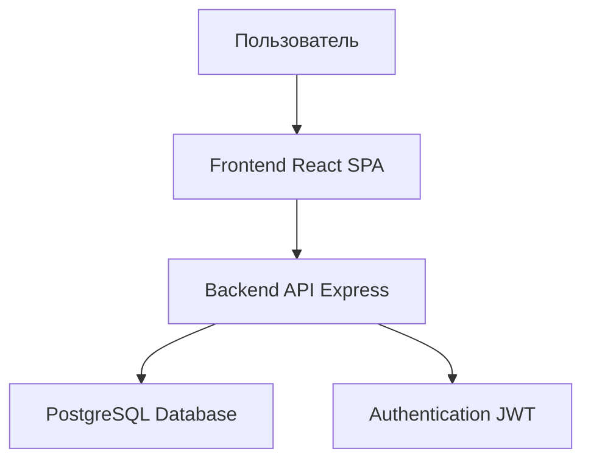
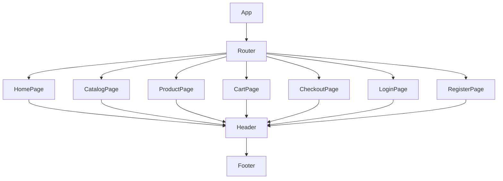

# Техническая спецификация веб-приложения "САВ-сервис"

## Обзор

Веб-приложение для покупки спецодежды с функциональностью каталога, корзины, оформления заказов и аутентификации пользователей.

## Стек технологий

- **Frontend**: React.js с TypeScript, Redux Toolkit для управления состоянием, Axios для HTTP запросов, Material-UI для компонентов UI.
- **Backend**: Node.js с Express.js и TypeScript, JWT для аутентификации.
- **Database**: PostgreSQL для хранения данных о товарах, пользователях, заказах.
- **Дополнительно**: Docker для контейнеризации, Git для контроля версий.

## Архитектура приложения

Приложение построено по архитектуре клиент-сервер с разделением на фронтенд и бэкенд.

### Диаграмма архитектуры

## Структура компонентов фронтенда

- **Страницы**:
  - HomePage (Главная)
  - CatalogPage (Каталог)
  - ProductPage (Страница товара)
  - CartPage (Корзина)
  - CheckoutPage (Оформление заказа)
  - LoginPage (Вход)
  - RegisterPage (Регистрация)
- **Общие компоненты**:
  - Header (Навигация)
  - Footer
  - ProductCard
  - SizeGrid (Размерная сетка)
  - ReviewForm (Форма отзыва)
- **Хуки и утилиты**:
  - useAuth (для аутентификации)
  - useCart (для корзины)

## API Спецификация

### Endpoints

- **GET /api/products** - Получить список товаров
- **GET /api/products/:id** - Получить товар по ID
- **POST /api/auth/login** - Вход пользователя
- **POST /api/auth/register** - Регистрация пользователя
- **GET /api/cart** - Получить корзину (требует аутентификации)
- **POST /api/cart** - Добавить товар в корзину
- **DELETE /api/cart/:id** - Удалить товар из корзины
- **POST /api/orders** - Создать заказ
- **GET /api/orders** - Получить заказы пользователя

### Структура данных

- **Product**: { id, name, description, image, sizes: [{ size, available }], price }
- **User**: { id, email, password, role }
- **CartItem**: { productId, quantity, size }
- **Order**: { id, userId, items: [CartItem], total, status }

## Диаграмма компонентов

## Безопасность

- Аутентификация через JWT токены.
- Защищенные маршруты для авторизованных пользователей.
- Валидация данных на фронтенде и бэкенде.

## Будущие расширения

- Профиль пользователя
- Админская панель для управления товарами и заказами
